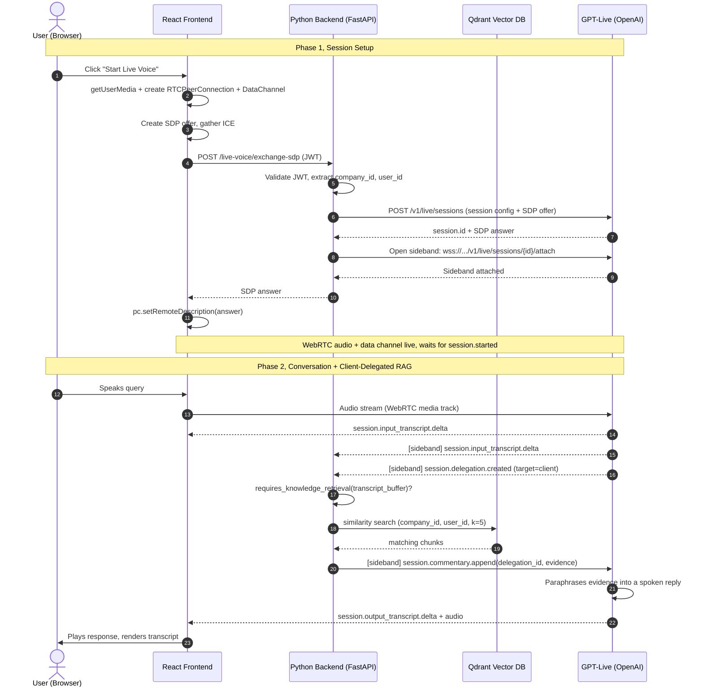

GPT-Live-1 became generally available in the API on September 10, 2026. It is OpenAI's full-duplex voice model: it can listen and speak at the same time, and it can hand off reasoning or tool use to a backend while the conversation keeps going. Wiring it into a real product still leaves you with the same hard architecture question every voice AI has: where does *your* logic live?

Two obvious approaches both fail:

- **Proxy the audio through your backend.** Simple, but it adds a full network hop in each direction, often 150 to 300ms of extra round-trip latency. In conversation, that delay is very noticeable.
- **Let the client talk straight to GPT-Live.** Fast, but now your backend has no visibility into the conversation. You can't inject retrieved knowledge, enforce tenant isolation, or run any server-side logic mid-call.

Our fix: split the **audio** from the **control logic**, using two features GPT-Live ships for exactly this: **client delegation** and a **sideband WebSocket**.

GPT-Live actually supports two delegation modes. *Responses delegation* has OpenAI run the backend model for you. *Client delegation* has your application prepare context, run your own agent or workflow, and send the result back. We use client delegation here, since the whole point is running our own tenant-scoped RAG lookup against Qdrant.

- **Audio (data plane):** client to GPT-Live, direct WebRTC. Zero backend hops.
- **Events (control plane):** backend to GPT-Live, a sideband WebSocket attached to the same session, observing delegation and transcript events and injecting results without ever touching the primary audio path.

*References: [Getting started with GPT-Live](https://developers.openai.com/api/docs/guides/live), [WebRTC](https://developers.openai.com/api/docs/guides/voice-webrtc?api=live), [Server-side controls](https://developers.openai.com/api/docs/guides/voice-server-controls), and [Delegation and tools](https://developers.openai.com/api/docs/guides/live-delegation), OpenAI API docs.*

## Architecture Overview



Just two tiers, a React frontend and a Python (FastAPI, async) backend. No extra gateway in between.

## Frontend: Setting Up WebRTC

The frontend has three jobs: grab the microphone, negotiate the peer connection, and react to events coming over the data channel. This follows GPT-Live's documented WebRTC connection sequence: create the data channel and register listeners *before* creating the SDP offer, then wait for `session.started` before sending any application commands.

```javascript
const stream = await navigator.mediaDevices.getUserMedia({ audio: true });

const pc = new RTCPeerConnection();
stream.getAudioTracks().forEach((track) => pc.addTrack(track, stream));

pc.addEventListener("track", (event) => {
  audioEl.srcObject = new MediaStream([event.track]);
  audioEl.play().catch(() => {
    // Autoplay was blocked; prompt the user to tap play.
  });
});

// Create the data channel before creating the offer.
const dc = pc.createDataChannel("oai-events");
dc.addEventListener("message", (e) => handleRealtimeEvent(JSON.parse(e.data)));

const offer = await pc.createOffer();
await pc.setLocalDescription(offer);
await waitForIceGatheringComplete(pc);

const res = await fetch("/live-voice/exchange-sdp", {
  method: "POST",
  headers: { Authorization: `Bearer ${jwt}`, "Content-Type": "application/json" },
  body: JSON.stringify({ sdp: pc.localDescription.sdp, agentId, chatId }),
});
const { sdp: answerSdp } = await res.json();
await pc.setRemoteDescription({ type: "answer", sdp: answerSdp });
// The HTTP request already started the session; do not send session.start here.
```

The data channel events drive the whole voice-widget UI state:

| Event | UI State |
|---|---|
| `session.started` | connected |
| `session.input_transcript.delta` | append user text |
| `session.delegation.created` | searching |
| `session.output_transcript.delta` | speaking, append AI text |
| `session.closed` | idle |

## Backend: The SDP Exchange Endpoint

The backend calls `POST /v1/live/sessions` on GPT-Live's behalf, passing both the session config (model, instructions, client delegation) and the browser's SDP offer in one request. It gets back a session ID and an SDP answer, then attaches the sideband to that same session before it replies.

```python
@router.post("/live-voice/exchange-sdp")
async def exchange_sdp(payload: ExchangeSDPRequest, user: AuthUser = Depends(get_current_user)):
    if not user.company_id or not user.user_id:
        raise HTTPException(status_code=403, detail="Missing tenant context")

    result = await openai_client.live.create(
        session={
            "model": "gpt-live-1",
            "instructions": "Be concise. Delegate any question that needs looked-up "
                             "company knowledge to the backend.",
            "delegation": {"type": "client"},
        },
        transport={"type": "webrtc", "sdp": payload.sdp},
    )

    sideband = LiveVoiceSidebandSession(
        session_id=result.session.id,
        company_id=user.company_id,
        user_id=user.user_id,
    )
    await sideband.connect()
    sideband_manager.register(result.session.id, sideband)

    return {"sdp": result.transport.sdp, "session_id": result.session.id}
```

The key rule: JWT validation and tenant-context checks happen **before** any call to GPT-Live. A request with no company or user context gets a 403 immediately; it never reaches session creation.

## The Sideband: Server-Side Logic Alongside the Conversation

The sideband is a second WebSocket the backend opens against the same session, at `wss://api.openai.com/v1/live/sessions/{session_id}/attach`. It carries structured events, delegation notices, transcript deltas, and (by default) reflected copies of the session's audio. Our backend only cares about the text events, so it simply ignores the audio ones, but that's worth knowing when planning bandwidth.

A client delegation event does **not** contain the user's question, only metadata (a delegation ID and target). The task text has to be reconstructed from the transcript deltas arriving alongside it, which is exactly what GPT-Live's own docs recommend.

```python
class LiveVoiceSidebandSession:
    def __init__(self, session_id: str, company_id: str, user_id: str):
        self.session_id = session_id
        self.company_id = company_id
        self.user_id = user_id
        self._transcript_buffer = ""
        self._input_revision = 0
        self._active_task: asyncio.Task | None = None

    async def connect(self):
        url = f"wss://api.openai.com/v1/live/sessions/{self.session_id}/attach"
        self.connection = await websockets.connect(
            url, additional_headers={"Authorization": f"Bearer {OPENAI_API_KEY}"}
        )
        asyncio.create_task(self._listen())

    async def _listen(self):
        async for raw in self.connection:
            event = json.loads(raw)
            match event["type"]:
                case "session.input_transcript.delta":
                    self._transcript_buffer += event["delta"]
                    self._input_revision += 1
                case "session.delegation.created":
                    delegation_id = event["delegation"]["id"]
                    await self._handle_delegation(delegation_id, self._transcript_buffer)

    async def _handle_delegation(self, delegation_id: str, query: str):
        # Cancel any in-flight RAG lookup for a stale turn.
        if self._active_task and not self._active_task.done():
            self._active_task.cancel()

        if not requires_knowledge_retrieval(query):
            return

        self._active_task = asyncio.create_task(self._run_retrieval(delegation_id, query))

    async def _run_retrieval(self, delegation_id: str, query: str):
        revision_at_start = self._input_revision
        chunks = await vectorization_service.search(
            query=query, company_id=self.company_id, user_id=self.user_id, limit=5
        )

        if revision_at_start != self._input_revision:
            return  # user kept talking, this turn is stale, drop it

        evidence = format_rag_context(chunks)  # plain string, kept under 500 tokens
        await self.connection.send(json.dumps({
            "type": "session.commentary.append",
            "event_id": f"rag_result_{delegation_id}",
            "delegation_id": delegation_id,
            "content": evidence,
        }))
```

Three details worth calling out:

1. **Filter out filler.** `requires_knowledge_retrieval()` skips the vector search entirely for turns like "hello," "thanks," "bye." Cheap, easy latency win.
2. **Track staleness by revision.** Every transcript delta bumps `_input_revision`. Before sending evidence back, we compare against the revision captured when the search started. If the user kept talking, the result is dropped instead of injected into a dead turn.
3. **Cancel, don't just check.** The staleness check alone isn't enough. We also cancel the in-flight task outright on a new delegation, so we're not burning vector-search queries on turns the user has already abandoned.

`session.commentary.append` is the event GPT-Live uses for results it should paraphrase and speak aloud; there's a sibling `session.thinking.append` for quiet context it can use later without saying it out loud. Content on either is capped at 500 tokens, so keep the RAG summary tight.

## Tenant Isolation

Every retrieval call is scoped by `company_id` and `user_id` **inside** the vector store query, not filtered afterward.

```python
async def search(self, query: str, company_id: str, user_id: str, limit: int = 5):
    embedding = await embed(query)
    return await qdrant_client.search(
        collection_name="knowledge_base",
        query_vector=embedding,
        query_filter=Filter(must=[
            FieldCondition(key="company_id", match=MatchValue(value=company_id)),
            FieldCondition(key="user_id", match=MatchValue(value=user_id)),
        ]),
        limit=limit,
    )
```

Isolation is enforced three times: JWT validation at the HTTP entrypoint, a presence check before session creation, and the Qdrant filter itself. Missing context stops the request at the earliest possible point; it never falls through to an unscoped query.

## Why This Beats the Alternatives

**vs. a full audio proxy:** no backend audio relay, so no added round-trip time on the hot path. The only extra hop (the RAG lookup) happens asynchronously via the sideband, not inline in the audio path.

**vs. pure client-side, no backend at all:** you lose tenant-scoped retrieval, auth enforcement, and the ability to keep vector-DB credentials off the client. The sideband gives you a secure, out-of-band channel for all of that without ever redirecting the primary audio stream.

## Production Notes

- **Sideband state is in-process** (a `_active_sessions` dict in the Python worker). Scale the backend horizontally and the session-to-sideband mapping breaks across pods. Move it to a Redis-backed registry, or pin session affinity explicitly at the load balancer.
- **Autoplay policies block `<audio>` playback** without a user gesture. Call `.play()` synchronously inside the click handler that opens the voice widget, not after an `await`.
- **Voice sessions are billed by duration, per second**, at $0.05/minute as of GA; backend model and tool usage bill separately. Note also that creating a WebRTC session bills 15 seconds of initialization time, credited against the running session rather than added on top, so don't double-count it in cost estimates.
- **Close sessions gracefully.** Send `session.close` and keep receiving events until `session.closed` arrives before tearing down the peer connection and microphone tracks; that final event is also where you get confirmed usage numbers. If the connection drops first, treat finalization as incomplete rather than assuming zero usage.

## Demo Implementation

A working reference implementation of this architecture is available here: **[github.com/rohit-p-droid/gpt-live-demo](https://github.com/rohit-p-droid/gpt-live-demo)**