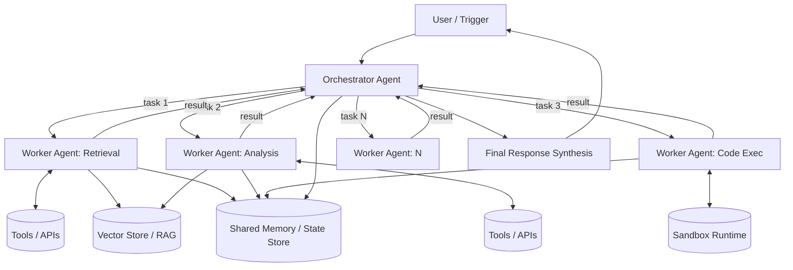
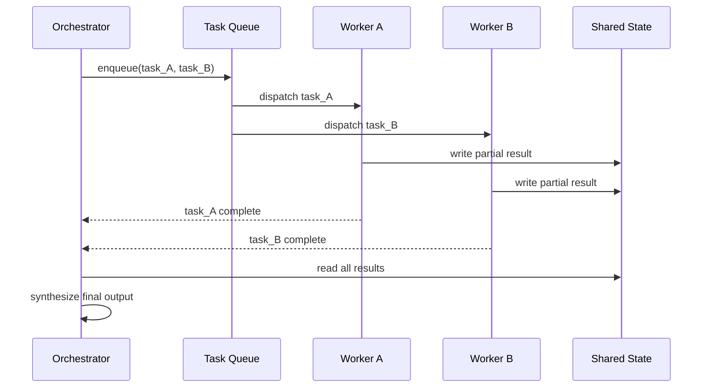
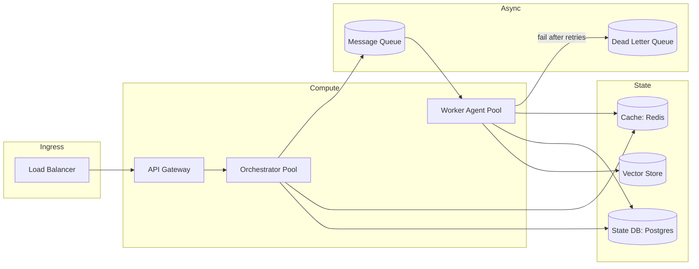

A year ago, "multi-agent system" mostly meant a LangChain demo where two chatbots argued with each other until someone got bored. Today it's how a growing number of production systems handle research, coding, customer support triage, and data pipelines. The gap between those two things is enormous, and almost nobody talks about it honestly.

This post is my attempt to close that gap. I'm going to walk through how these systems are actually architected, where they break in production, and the trade-offs I've had to make, often the hard way, while building them. If you've only ever seen multi-agent systems in a notebook, some of this will feel like a cold shower. Good. That's the point.

---

## 1. Single Agent vs Multi-Agent: When Do You Actually Need This?

Let's start with the question everyone skips: **do you even need multiple agents?**

A single agent is one LLM loop with a system prompt, a set of tools, and a context window. It reasons, calls a tool, observes the result, and repeats, the classic ReAct-style loop. For a huge chunk of real use cases, this is not just sufficient, it's *better*. Fewer moving parts, one context to debug, predictable latency, one place for things to go wrong.

You reach for multi-agent when at least one of these is true:

- **The task decomposes naturally into specialized roles** that need different tools, prompts, or even different models (a cheap fast model for classification, an expensive reasoning model for synthesis).
- **Context length becomes the bottleneck.** A single agent doing deep research on 40 documents will drown its own context window. Splitting the work across sub-agents that each read a slice and report back keeps each context focused.
- **You need parallelism.** Independent sub-tasks (scrape 10 sources, analyze 10 datasets) can run concurrently instead of sequentially inside one agent's loop.
- **You want isolation for reliability.** If one sub-agent hallucinates or gets stuck in a loop, you don't want it corrupting the entire task's context, you want to catch it, retry it, or discard its output.

The trade-off you're accepting in return: coordination overhead, more failure surfaces, higher latency for simple tasks, and a much harder debugging story. I've seen teams multi-agent-ify a task that a single well-prompted agent with a good tool loop would've handled in a third of the time and cost. Don't do that. Multi-agent is a scaling and specialization pattern, not a maturity badge.

---

## 2. Core Multi-Agent Architecture

Here's the architecture I keep converging on, regardless of the specific domain (research assistants, coding agents, support automation):

### Orchestrator

The orchestrator is not "the smart agent that bosses the others around", think of it as a **planner + router + aggregator**. Its jobs:

1. Decompose the incoming task into sub-tasks (either via explicit planning, a fixed DAG, or dynamic re-planning).
2. Route sub-tasks to the right worker agent (by capability, tool access, or load).
3. Track state, what's done, what's pending, what failed.
4. Aggregate and reconcile worker outputs into a final answer.

The orchestrator pattern itself has variants worth knowing:

- **Supervisor pattern**, one orchestrator, static hierarchy, workers can't talk to each other directly. Simplest to reason about, easiest to debug. This is what I default to.
- **Hierarchical / recursive**, orchestrators that spawn sub-orchestrators, useful when sub-tasks are themselves complex enough to need decomposition (e.g., "research this market" spawning "research competitor A", each of which spawns its own retrieval + synthesis agents).
- **Decentralized / peer-to-peer**, agents negotiate and hand off tasks among themselves with no central authority. Theoretically elegant, practically a nightmare to debug at scale. I've only seen this work well in constrained, well-bounded domains (e.g., market simulations). I'd avoid it for anything customer-facing.

### Worker Agents

Workers should be **narrow and boring**. The biggest mistake I see is giving every worker agent the same giant tool belt and a generic prompt, then wondering why coordination is chaotic. A worker agent should have:

- A tight system prompt scoped to *one* responsibility.
- Only the tools it needs, not the full toolbox. This isn't just cleanliness, it materially reduces hallucinated tool calls, because the model has fewer wrong options to pick from.
- A clear input/output contract (ideally structured, e.g., a Pydantic/JSON schema) so the orchestrator doesn't have to parse free text to figure out what happened.

### Memory

Two distinct memory needs get conflated constantly:

- **Working memory / state**, what's happened *this run*: task graph status, intermediate results, tool outputs. This lives in a fast store (Redis, an in-memory state object, a workflow engine's state) and dies (or gets archived) when the run ends.
- **Long-term memory**, facts, preferences, prior conversations that should persist across runs. This is usually a vector store plus a structured store (user profile, past decisions), queried via RAG.

Treating these as the same thing is a common source of bugs, you end up either polluting long-term memory with ephemeral run state, or losing working memory because it wasn't durable enough to survive a crash.

### Tools & RAG

Tools are how agents touch the real world, APIs, databases, code execution, search. RAG is really just a specific tool: retrieval over a knowledge base. I mention it separately because it deserves separate design attention, chunking strategy, retrieval relevance, and re-ranking affect agent behavior far more than people expect. A worker agent with a mediocre prompt and great retrieval will outperform a great prompt with mediocre retrieval, almost every time.

---

## 3. Agent Communication Patterns

How agents pass information around is where most of the "it worked in the demo, fell apart in prod" stories originate.

Three patterns show up repeatedly:

**1. Direct message passing.** Orchestrator calls worker, gets a return value, synchronously or via callback. Simple, but couples the orchestrator to worker availability, if a worker hangs, the orchestrator hangs (unless you've built timeouts, which you must).

**2. Shared state / blackboard pattern.** Agents don't talk to each other directly; they read and write to a common state store, and orchestration logic decides what happens next based on state transitions. This decouples agents nicely and is much easier to make durable, if the process crashes, you can resume from the state store instead of losing the whole run. I lean toward this for anything that needs to survive longer than a few seconds.

**3. Message queue / event-driven.** Agents publish events (`task.completed`, `document.retrieved`) and other agents subscribe. This is the only pattern that scales cleanly to many concurrent agents and many concurrent runs, because it naturally load-balances and buffers bursts. It's also the most operationally heavy, you're now running a distributed system with all the usual joys: ordering guarantees, dead-letter queues, idempotency.

A concrete trade-off I hit often: synchronous direct calls give you lower latency for simple two-agent handoffs, but the moment you have more than 3-4 agents or need retries, an event-driven backbone (Kafka, SQS, Redis Streams) pays for itself almost immediately in resilience.

---

## 4. Memory and Context Management

Context management is arguably the least glamorous, most failure-prone part of multi-agent design. A few things I've learned the hard way:

- **Context isn't free, every token you pass costs latency and money, both directly (API cost) and indirectly (longer contexts degrade attention and increase hallucination rate).** Don't pass full worker transcripts back to the orchestrator. Pass structured summaries.
- **Summarization is a design decision, not an afterthought.** When and how you compress a worker's output before handing it upstream materially changes what the orchestrator can and can't do with it. I usually have workers emit a structured result object (facts extracted, confidence, sources) rather than a narrative summary, narratives are lossy and inconsistent across runs.
- **Context windows are not a substitute for a memory architecture.** Just because your model supports 200K tokens doesn't mean you should stuff everything in there. Retrieval-based context injection (pull only what's relevant to the current sub-task) consistently outperforms "just include everything" in both cost and accuracy once you're past toy-scale tasks.
- **Session vs. persistent memory needs different invalidation strategies.** Stale long-term memory (an outdated user preference, an old fact that's since changed) is a quieter, nastier bug than a crash, the system doesn't error, it just confidently gives wrong answers. Version your memory writes and give yourself a way to invalidate.

---

## 5. System Design Considerations

This is where "AI engineer" and "system design architect" have to actually be the same job, not two separate hats.

**Scalability.** Orchestrators and worker agents should scale independently, they have very different load profiles. Orchestrators are typically lightweight (planning + routing), while worker agents do the heavy lifting (LLM calls, tool execution) and need horizontal scaling behind a queue. Don't put them in the same deployment unit; you'll either over-provision the cheap part or starve the expensive part.

**Fault tolerance.** Every agent call needs three things or you don't have a production system, you have a prototype with delusions of grandeur:
- **Timeouts**, LLM calls and tool calls both hang sometimes; unbounded waits cascade into resource exhaustion upstream.
- **Retries with backoff**, but only for idempotent operations, retrying a "charge the customer" tool call without idempotency keys is how you generate incident reports.
- **Circuit breakers**, if a downstream tool/API is degraded, stop hammering it and fail fast, ideally with a graceful degradation path (return partial results, fall back to a cheaper agent, or queue for later).

**Queues.** Once you have more than a couple of agents, a queue (SQS, Kafka, Redis Streams, or a workflow engine like Temporal) stops being optional. It buys you backpressure handling, durability across crashes, and natural load leveling for bursty traffic. The trade-off is added latency (queue hop) and operational complexity (you now own a distributed system's failure modes: duplicate delivery, ordering, poison messages).

**Caching.** Cache aggressively at multiple layers: retrieval results (same query, same documents), tool call results (idempotent lookups), and even full agent responses for semantically similar requests (embedding-based cache lookup, not just exact string match). I've cut both latency and cost by 30-40% on production agent systems purely through a retrieval + tool-result cache layer, this is usually higher leverage than model or prompt optimization.

**Load balancing.** Beyond the standard request load balancing, you need *model-aware* routing: some sub-tasks genuinely need a frontier reasoning model, others are fine on a smaller/cheaper model. Routing by task complexity (sometimes via a cheap classifier agent) rather than using one model tier for everything is one of the highest-ROI architecture decisions you can make.

---

## 6. Real-World Challenges (the part nobody's slide deck covers)

**Agent coordination failures.** The classic failure: Agent A assumes Agent B already validated the data; Agent B assumed Agent A would. Nobody did. This is a contract problem, not an intelligence problem, the fix is explicit input/output schemas and validation at hand-off boundaries, not "prompt them to communicate better."

**Hallucination compounding.** In a single agent, a hallucination is contained to one output. In a multi-agent pipeline, a hallucinated fact from Worker A becomes an input premise for Worker B, who builds on it confidently, and by the time it reaches the orchestrator it looks like a well-corroborated conclusion because multiple agents "agree" on it, they just all inherited the same bad fact. I've started treating this as a first-class failure mode: verification agents that check specific claims against source documents, not just "does this look reasonable."

**Infinite loops and runaway agents.** Two agents handing a task back and forth ("this isn't my responsibility" / "no, it's yours") is real and happens more than you'd think, especially with dynamic re-planning. Hard caps matter: max iteration counts, max token budgets per run, and a "stuck detector" (has the state genuinely changed in the last N steps, or are we just re-deriving the same thing).

**Latency.** Multi-agent systems are chatty by nature, and chattiness plus sequential dependencies is a latency killer. A pipeline of 5 agents at 3 seconds each isn't 3 seconds, it's 15+ if sequential. Parallelize aggressively wherever tasks are actually independent, and be honest with product/UX about what "real-time" means for a system that's making a dozen LLM calls under the hood, sometimes the right answer is streaming partial results, not making the pipeline faster.

**Cost.** Multi-agent systems multiply your LLM spend fast, every hand-off is another set of tokens, and every worker often re-reads context the orchestrator already had. Track cost per completed task, not per API call, or you'll optimize the wrong thing. Model routing (cheap model for extraction/classification, expensive model for synthesis/reasoning) is the single biggest lever here.

**Security.** This one gets underrated. Multi-agent systems with tool access are effectively distributed systems with LLM-controlled control flow, which means prompt injection isn't just an "it said something embarrassing" risk, it's a "an agent with database write access got tricked by a malicious document into doing something destructive" risk. Treat every piece of content an agent reads (web pages, documents, tool outputs) as untrusted input, sandbox code execution agents properly, apply least-privilege tool scoping per agent, and log every tool call for auditability. I don't let any agent have both broad read access to sensitive data *and* unsupervised write/execute access, that combination is where the real incidents come from.

---

## 7. Production Best Practices

A few things that consistently separate systems that survive contact with real users from ones that don't:

- **Observability from day one.** Trace every agent call, every tool call, every hand-off, structured logs with a run ID that threads through the whole execution, not just final-output logging. When something goes wrong (and it will), you need to reconstruct the exact sequence of decisions, not guess.
- **Structured outputs everywhere.** Free-text hand-offs between agents are a debugging and reliability tax you pay forever. Force structured (schema-validated) outputs at every agent boundary.
- **Deterministic orchestration where possible.** Let the LLM do the reasoning-heavy parts (planning, synthesis), but keep the control flow (retries, routing logic, state transitions) in regular code, not in another LLM call. LLM-orchestrating-LLMs sounds elegant and is much harder to debug and test than a state machine with LLM-powered nodes.
- **Evaluation harnesses, not vibes.** Build a regression test suite of real task scenarios and run it on every prompt/architecture change. Multi-agent systems are especially prone to silent regressions, you fix Worker A and accidentally break an implicit assumption Worker B was relying on.
- **Graceful degradation.** Design for partial success. If 3 of 5 workers succeed, can you still deliver something useful, clearly labeled as partial, rather than failing the whole run?
- **Budget guardrails, not just token limits.** Set hard ceilings on cost and iteration count per run, with alerting, so a bug doesn't turn into a five-figure API bill overnight.

---

## 8. Where This Is Heading

A few trends I'm watching closely, cautiously:

- **Standardized inter-agent protocols** (structured tool-calling standards, emerging agent-to-agent communication specs) are starting to reduce the "everyone hand-rolls their own orchestration format" problem. This matters for interoperability the same way HTTP mattered for the web, right now every multi-agent framework is its own island.
- **Better native support for durable, long-running agent workflows** (workflow engines built for LLM-in-the-loop execution) is closing the gap between "agent demo" and "agent that can survive a process restart," which has been one of the biggest gaps between prototype and production.
- **Smaller, cheaper specialized models as workers**, with expensive frontier models reserved for orchestration/synthesis, is becoming the default cost architecture rather than the exception.
- **Formal verification and guardrail layers** around agent actions, especially for anything touching money, infrastructure, or irreversible actions, are moving from "nice to have" to "compliance requirement" as these systems get deployed in more regulated domains.

None of this makes multi-agent systems easy. It makes them *tractable*, which, honestly, is the more interesting engineering problem. The hard part was never getting an LLM to reason. It's building the boring distributed-systems scaffolding, queues, retries, state management, observability, that lets that reasoning survive contact with production traffic.

If you take one thing from this post: multi-agent architecture is systems engineering with a probabilistic component bolted on, not prompt engineering with extra steps. Design it like the former, and the latter takes care of itself.